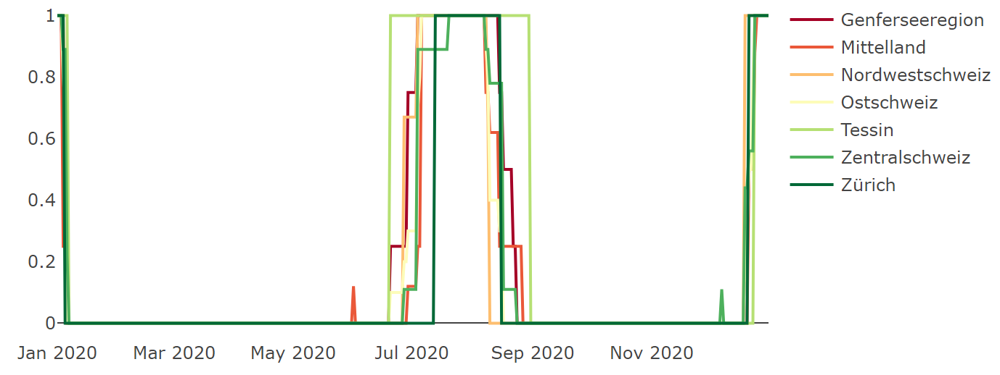

<!-- README.md is generated from README.Rmd. Please edit that file -->

```{r, include = FALSE}
knitr::opts_chunk$set(
  collapse = TRUE,
  comment = "#>",
  fig.path = "man/figures/README-",
  out.width = "100%"
)
```

# holidays

<!-- badges: start -->
<!-- badges: end -->

The _holidays_ dataset package contains Swiss school holiday data from 1.–9. grade in the period 2020 until 2025, covering six years in total. The data was scraped from schulferien.org in July 2022. The datasets are structured such that they seamlessly integrate with modeling in machine learning (ML). To further facilitate the handling of the data, the package provides functions for exploratory data analysis (EDA).


## Installing the package
To use the package start by initiating the devtools package which in turn
allows you to load _holidays_ from github. The build_vignettes=TRUE parameter ensures
that the package vignette is available after loading the package.

```{r install_holidays, include=TRUE, echo=TRUE, message=FALSE, warning=FALSE}
#install.packages("devtools")
library(devtools)

#install_github("Schiggy-3000/holidays", build_vignettes=TRUE)
library(holidays)
```


<br />


## Available datasets
You find the list of available datasets down below. Note that XX is a placeholder for
numbers from 20 through 25, completing the respective calendar year.

- **holidays_20XX_dates** <br>
<span style="color: grey;">School holidays at the scope of cantons as date ranges. This dataset type is not meant for ML but merely to get an overview of the holidays in a particular year.</span>
- **holidays_20XX_long** <br>
<span style="color: grey;">School holidays at the scope of cantons (e.g. Aargau, Bern) where every day occupies a separate row.</span>
- **holidays_20XX_long_major_regions** <br>
<span style="color: grey;">School holidays at the scope of major regions (e.g. Mittelland, Zentralschweiz) where every day occupies a separate row.</span>
- **holidays_20XX_long_switzerland** <br>
<span style="color: grey;">School holidays at the scope of Switzerland where every day occupies a separate row.</span>

The datasets in long format from above are also available for six year periods.

- **holidays_2020_to_2025_long**
- **holidays_2020_to_2025_long_major_regions**
- **holidays_2020_to_2025_long_switzerland**

<span style="color: red;">**CAUTION:**</span> You might be familiar with the fact
that Switzerland has 26 cantons and thus expect that the above mentioned datasets
hold vacation data for exactly 26 entities. This is not the case! Certain 
cantons appear multiple times. This is due to the fact that some cantons report
holidays for more than one school type. For instance, Freiburg has separate
holiday schedules for elementary and high school and thus comes up twice.
We mention this right at the outset as all datasets share this feature.
Understanding this peculiarity is essential considering that an aggregated
dataset such as _holidays_2020_long_switzerland_ is not an aggregate
of 26 cantons, but of 36 canton+school combinations. The following excerpt of
dataset _holidays_2020_dates_ should clarify this matter.

```{r available_datasets, eval=TRUE, echo=FALSE}
# Load holidays_2020_dates dataset.
df.20 <- get("holidays_2020_dates")

# Open the table and inspect columns 'Kanton' and 'Schule'
df.20[1:5, c("Kanton", "Schule", "Sportferien")]
```

As you can see, Appenzell Innerrhoden comes up twice where each instance has
its own _Schule_ and schedule for _Sportferien_.


<br />


## Loading datasets
Using the data() command adds a given dataset to the global environment. For this, simply insert the name of a dataset from the list above into its brackets. If you prefer a more concise label, use get() and assign it to a variable of your choice.

```{r load_datasets, include=TRUE, echo=TRUE}
# Load datasets into the global environment.
data("holidays_2020_dates")
data("holidays_2023_long")
data("holidays_2020_to_2025_long_major_regions")

# Load a dataset into the global environment and assign it a new name.
df <- get("holidays_2020_to_2025_long_major_regions")

```


<br />


## Get to know the data - holidays_20XX_dates datasets
Start by looking at _holidays_20XX_dates_ datasets. They show school holidays per canton in an easy-to-read format.
```{r examine_datasets, eval=FALSE}
# Choose a holidays_20XX_dates dataset.
df.20 <- get("holidays_2020_dates")
df.21 <- get("holidays_2021_dates")
df.22 <- get("holidays_2022_dates")
df.23 <- get("holidays_2023_dates")
df.24 <- get("holidays_2024_dates")
df.25 <- get("holidays_2025_dates")

# Open table.
View(df.20)
```


<br />


## Get to know the data - Dataset documentations
Every dataset has its own documentation. Browse through it in case you need a concise description of its columns.

```{r examine_datasets_doc, eval=FALSE}
# Dataset documentations.
?holidays_20XX_dates
?holidays_20XX_long
?holidays_20XX_long_major_regions
?holidays_20XX_long_switzerland
?holidays_2020_to_2025_long
?holidays_2020_to_2025_long_major_regions
?holidays_2020_to_2025_long_switzerland
```


<br />


## Get to know the data - EDA functions
Familiarize yourself with the data in greater detail by using the built-in EDA functions.

- **holidays_heat_map()** <br>
<span style="color: grey;">Generates an interactive heat map.</span>
- **holidays_time_series()** <br>
<span style="color: grey;">Generates an interactive time series plot.</span>
- **holidays_bar_chart()** <br>
<span style="color: grey;">Generates an interactive bar plot.</span>
- **holidays_describe()** <br>
<span style="color: grey;">Generates an overview of all variables of the dataset.</span>

```{r examine_datasets_1, eval=FALSE}
# Choose any of the datasets in long format.
# This includes all datasets that have 'long' in their name.
df <- get("holidays_2020_long_major_regions")

# Select holidays that you wish to plot on the heat map.
# Possible values are 'Sportferien', 'Fruehlingsferien', 'Sommerferien',
# 'Herbstferien', and 'Weihnachtsferien'.
# If you pass nothing, all types are included.
types <- c("Sommerferien", "Weihnachtsferien")

# Plot the heat map.
# The additional parameter 'normalize' is relevant for aggregated datasets.
# This includes datasets with 'major_regions' or 'switzerland' in their name. 
# Not all major regions have the same number of cantons associated with them.
# Genferseeregion: Genf, Waadt, Wallis
# Zentralschweiz: Luzern, Nidwalden, Obwalden, Schwyz, Uri, Zug
# If you print the heat map for dataset 'holidays_2020_long_major_regions' with
# normalize=FALSE, 'Zentralschweiz' would have higher aggregated values as it
# sums up values from more cantons (actually canton+school combinations. In
# case you don't know what this is about, go back and read the CAUTION part 
# near the start of this vignette) than 'Genferseeregion'.
holidays_heat_map(data=df, holidaytype=types, normalize=TRUE)
```
```{r plot_1, echo=FALSE, eval=TRUE, out.width ="85%", fig.align="center"}
# Display image
# Readme.md can't render HTML output. This is why we display a simple image instead.

```


```{r examine_datasets_2, eval=FALSE}
# Plot time series.
holidays_time_series(data=df, holidaytype=types, normalize=TRUE)
```
```{r plot_2, echo=FALSE, eval=TRUE, out.width ="85%", fig.align="center"}
# Display image
# Readme.md can't render HTML output. This is why we display a simple image instead.

```

```{r examine_datasets_3, eval=FALSE}
# Let's see which major region has the highest average of holidays during
# summer vacation across all years.
df <- get("holidays_2020_to_2025_long_major_regions")
types <- c("Sommerferien")

# Plot bar chart.
# Note that the number of days gradually get lower for most major regions
# over the years. This is due to the fact that holidays in later years were
# not available at the time we scraped this information. For instance, Tessin
# had only one reported day during summer vacation in 2025.
holidays_bar_chart(data=df, holidaytype=types, normalize=TRUE)
```
```{r plot_3, echo=FALSE, eval=TRUE, out.width ="85%", fig.align="center"}
# Display image
# Readme.md can't render HTML output. This is why we display a simple image instead.

```


```{r examine_datasets_4, eval=FALSE}
# Column description.
# This function is similar to str() from the utils package.
# It shows all unique values from each column. If you are interested in
# the different types of schools there are or a collection of all major
# regions, use this function.
df <- get("holidays_2020_long")
holidays_describe(df)
```
```{r plot_4, echo=FALSE, eval=TRUE, out.width ="85%", fig.align="center"}
# Display image
# Readme.md can't render HTML output. This is why we display a simple image instead.

```
